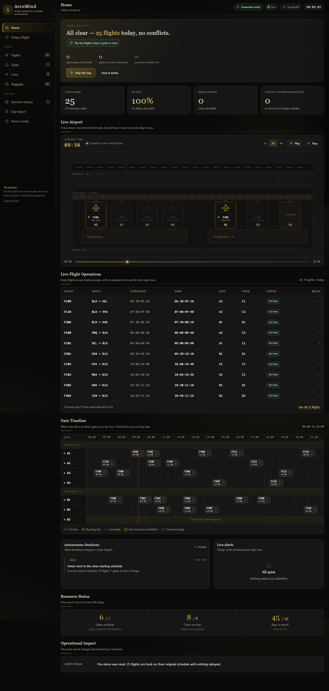
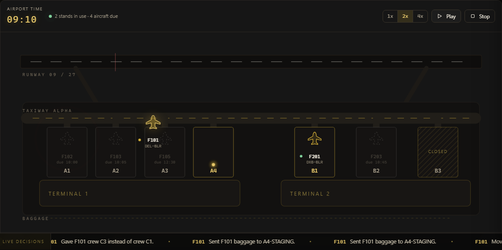
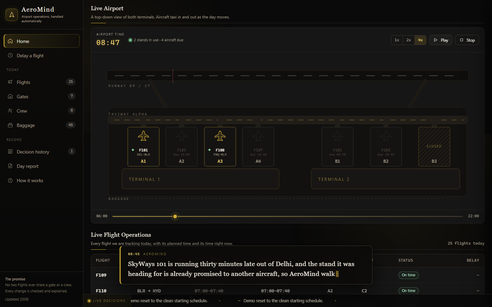
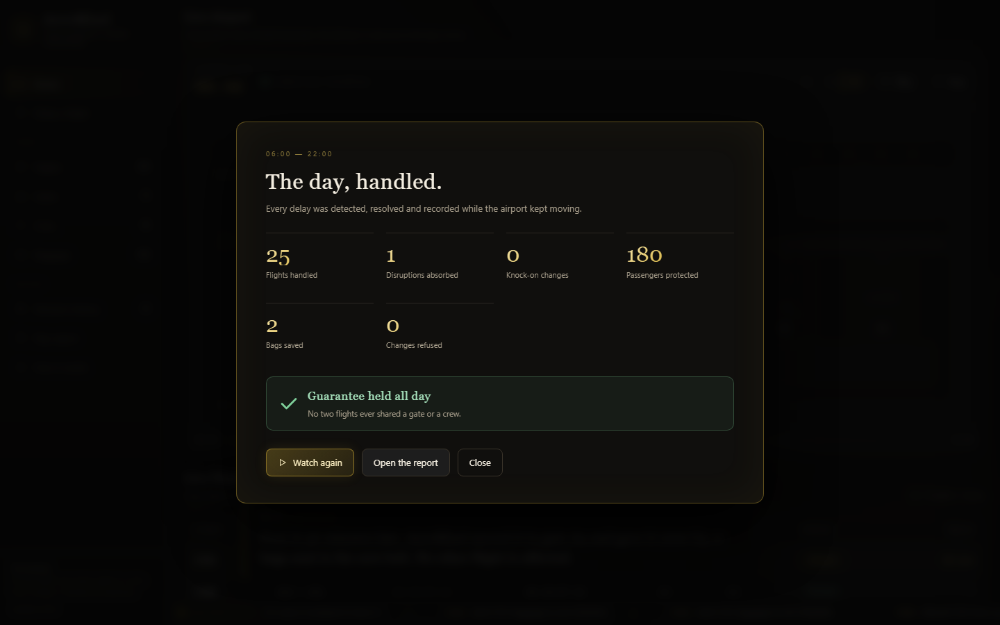
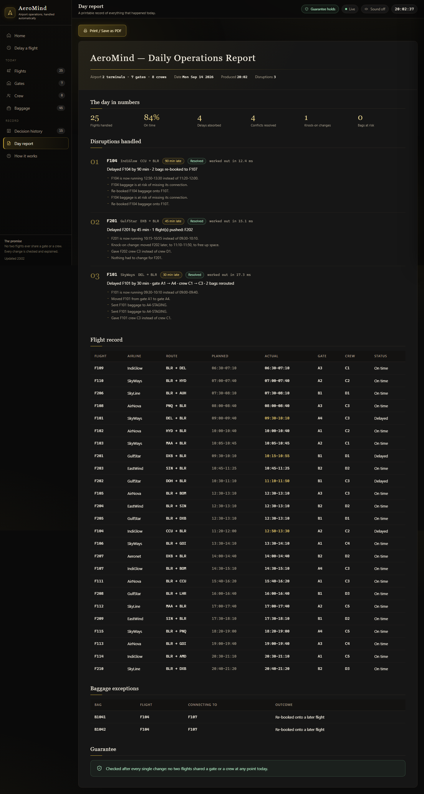
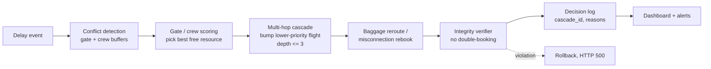
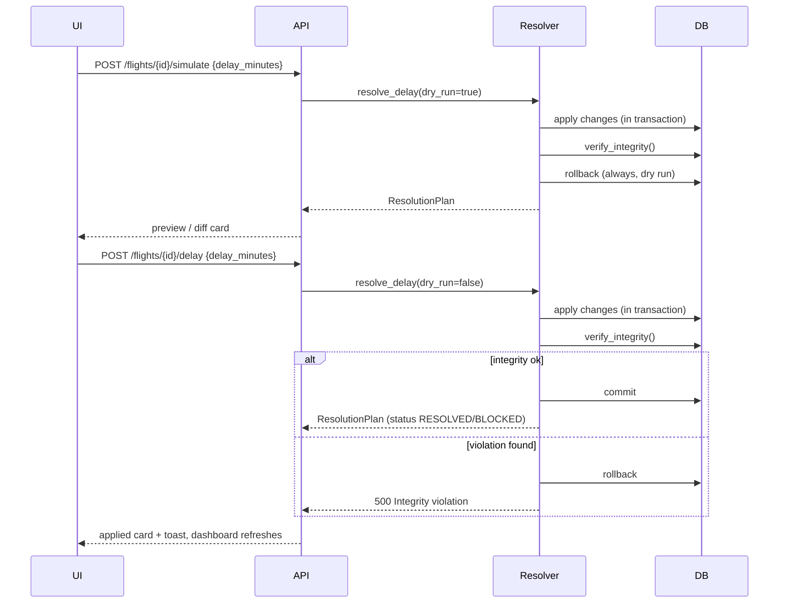

# AeroMind — Autonomous Airport Operations Control

> One delay. Every ripple. Resolved in seconds.

New here? Start with the [screenshot walkthrough](docs/WALKTHROUGH.md) — a screen-by-screen tour for non-technical readers.



Airports run on a tight, invisible schedule: every gate, every ground crew, and every suitcase is booked to the minute. When one flight lands late, that schedule doesn't just slip for that flight — it can knock into the next aircraft's gate, the next job on a crew's shift, and bags already on their way to a flight that hasn't shown up yet. AeroMind watches that schedule, and the moment a flight is delayed, it works out everything the delay touches, fixes it automatically, shows you exactly what it changed and why, and lets you check the plan before it goes live.

---

## The concept, in plain words

**What a delay really does.** An airport is really just a very tight, very literal schedule: this gate is free from 9:00 to 9:55, this crew is free from 10:00 to 10:40, this suitcase has 30 minutes to get from one plane to the next. A 40-minute delay doesn't just make one flight late — the plane now sitting at that gate has to move somewhere, the crew that was about to start their next flight is still busy, and bags already heading toward the next leg are chasing a connection that no longer exists. Fixing the late flight by itself can quietly break three other things.

**What AeroMind does about it.** The moment a flight is delayed, AeroMind checks its new gate and crew window against everyone else already booked, finds anyone it now collides with, and reassigns gates, crews, and baggage routing so nothing overlaps — and if literally nothing is free, it pushes a lower-priority flight out of the way and fixes whatever that push disturbs too, instead of stopping at the first problem it finds.

**What "guarantee" means here.** AeroMind's one hard promise is that no two flights are ever given the same gate or the same crew at the same time. After every single change, the system re-checks the entire schedule from scratch for exactly that kind of clash; if it ever finds one, it undoes the change rather than leaving a broken schedule in place. That check is shown live on screen as a small badge, so it isn't just a claim in this document — it's something you can watch stay at zero the whole time you're using it.

**What "preview before apply" means.** Before committing to a delay, you can ask AeroMind to show you the full plan first — the new gate, the new crew, which bags get rerouted, who else would have been affected — without changing anything yet. Only clicking Apply makes any of it real. That's the difference between finding out a decision was risky after it happened and seeing the ripple effects before you commit to them.

**What the decision history is for.** Every gate swap, crew reassignment, baggage reroute, and blocked delay is written down with a plain-English reason the moment it happens — not just the outcome, but why. That gives an operator, a judge, or an auditor a full paper trail of the airport's actual decisions during a disruption, instead of having to trust that the automation did the right thing.

---

## The wow tour

Five things worth seeing before touching a single button. Full descriptions are in the [screenshot walkthrough](docs/WALKTHROUGH.md).


The product introduces itself before it shows a single number: the mark draws itself in gold over flight paths arcing across a black sky, then invites you in with one button, "Enter the control room."



A top-down, real-time view of both terminals — runway, taxiway, and every stand — where aircraft actually glide to a new gate the moment AeroMind moves them, with a red pulse on the stand they left and a gold ripple on the one they took.



A virtual clock runs the whole 06:00–22:00 day at up to 4x speed and pauses itself at five real disruptions, typing out what went wrong and what AeroMind did about it — the entire demo can run itself while you talk.



An end-of-day scorecard: flights handled, disruptions absorbed, knock-on changes, passengers protected, bags saved — and the line that matters, "Guarantee held all day."



The same day as a printable document: a masthead, the day's numbers, every disruption explained with how many milliseconds it took to resolve, the full flight record, and a closing guarantee statement — one click on "Print / Save as PDF."

A 59-second recording of one full Play-the-day run lives at [`docs/demo-play-the-day.webm`](docs/demo-play-the-day.webm) — GitHub can't play `.webm` inline, so download it to watch.

---

## The problem

A flight is late by 40 minutes. Its gate is now occupied. The next aircraft has nowhere to go. A crew is waiting at the wrong terminal. Baggage is moving toward a flight that hasn't arrived. Every decision fixes one problem while creating another — the hard part of airport operations isn't the first delay, it's everything it touches next.

That's not an edge case, it's the majority of the problem: across European air traffic, reactionary ("knock-on") delay — one flight's lateness causing another's — was the single largest contributor to total delay minutes in 2023 and 2024, at roughly 46% of all delay minutes, more than weather, ATC, or airline-caused delay combined [1]. Absorbing the first disruption isn't enough; the system has to keep the second, third, and fourth-order effects from compounding.

---

## What AeroMind does

| Requirement | Feature |
|---|---|
| Reassign gates, crews, baggage dynamically as delays occur | Resolver engine picks the best free gate/crew by load and slack, reroutes bags to gate staging automatically |
| Guarantee no two flights ever share a gate or crew | `verify_integrity()` runs after every committed change; `/integrity` endpoint + dashboard badge report live violation count |
| Propagate one change through all dependent resources | Multi-hop cascade solver — if nothing is free, it bumps the lower-priority flight and re-resolves *its* conflicts, up to 3 hops deep, all grouped under one `cascade_id` |
| Surface knock-on impact before it compounds | `POST /flights/{id}/simulate` runs the entire resolution as a dry run and returns the full plan — conflicts, cascade, bags — without touching the database; the UI renders it as a preview/diff before the operator commits |

---

## How it works



- **Conflict detection** — extends every flight's gate/crew window by the buffer constants below and checks for overlap against everything else scheduled on that resource.
- **Scoring** — gates score by how lightly loaded they are (fewest existing flights, then largest slack); crews score by remaining shift slack, same-terminal before cross-terminal.
- **Cascade** — if no resource is free, the conflicting flight is bumped (if it's lower priority and depth allows) and resolved recursively, so a single delay can ripple through several flights in one committed transaction.
- **Baggage** — bags on the delayed flight move to gate staging; bags with a connection under `MIN_CONNECTION_MIN` are flagged at risk and rebooked onto a later flight to the same destination if one exists.
- **Integrity verifier** — re-checks the entire schedule for gate/crew overlaps after every commit; any violation rolls the transaction back and returns an error instead of silently corrupting state.
- **Decision log & dashboard** — every action (delay, reassignment, bump, reroute, block) is written with a reason and severity, then surfaced as live alerts and a Gantt-style timeline.

**Preview vs Apply** — the same resolver runs either way; the only difference is whether the transaction is committed or rolled back at the end.



---

## Domain rules & constants

| Constant | Value | Meaning | Grounded in |
|---|---|---|---|
| `GATE_BUFFER_MIN` | 15 min | Min gap between consecutive flights on the same gate | Real turnarounds run 25–40 min for narrowbody short-haul, with ops guidance suggesting ~30 min between flights on the same stand [2]; halved here to keep an 06:00–22:00 demo day dense enough to produce conflicts |
| `CREW_REST_MIN` | 20 min | Min gap between consecutive assignments for a crew | FAA Part 121 mandates 9–11 hours of rest between duty periods depending on flight time [3]; compressed to minutes so a single demo day can show a rest violation |
| `CREW_TRANSIT_MIN` | 30 min | Extra lead time if crew's home terminal ≠ flight terminal | Modeled on the terminal-change premium built into real minimum-connection-time tables [4]; no single published figure exists for crew repositioning specifically, so this is a reasoned estimate |
| `MIN_CONNECTION_MIN` | 30 min | Bag needs ≥ this between arrival and connecting departure | Matches typical published domestic MCTs of ~30 minutes [4] |
| `MAX_CASCADE_DEPTH` | 3 hops | How many "bump the lower-priority flight" hops are allowed | Design choice, not from literature — bounds runtime and keeps the decision log explainable; a real system would cascade until the schedule settles |

**Simplifications** — same-day `HH:MM` times only, no midnight rollover or multi-day schedules; a single airport, no network effects from other stations; a crew is modeled as one interchangeable unit rather than individual crew members with their own duty clocks; gate/crew scoring is a greedy heuristic, not a global optimum (see below); baggage has no physical transit time between gate and staging.

The underlying assignment problem AeroMind is solving — pack flights onto scarce gates and crews without collisions — is a variant of the airport gate assignment problem, which is known to be strongly NP-hard (it reduces to a quadratic assignment problem); published approaches use branch-and-bound for small exact instances and heuristics such as beam search, simulated annealing, or tabu search at scale [5]. AeroMind uses a fast greedy heuristic (lowest-load gate, most-slack crew, tie-broken deterministically) rather than a solver — it returns an explainable, sub-second answer instead of a global optimum. See "Why not an ILP solver?" below.

---

## Guarantee: no double-booking

Every committed change — a delay, a cascade bump, a preset run, chaos mode — runs `verify_integrity()` immediately after the change is staged, before it is committed. The check re-scans every gate and crew for overlapping windows (respecting the same buffers used during resolution) and for crew assignments outside their shift. If it finds even one violation, the whole transaction is rolled back and the API returns `500 {"detail": "Integrity violation", "violations": [...]}` instead of persisting a bad state — this is meant to never happen; it's the safety net, not the primary mechanism. The same check is exposed as `GET /integrity` and polled by the UI every 5 seconds, shown as a "Guarantee holds" badge in the top bar (with a "No two flights share a gate or crew" line on Home) so the invariant is visibly true throughout the demo, not just asserted in code.

---

## Demo data

The seed airport (`POST /scenario/reset`) always comes back to the same known-good state: **25 flights, 7 gates, 8 crews, 45 bags**, running 06:30–21:20 across two terminals.

- **Terminal T1** — gates A1–A4 (all available) · crews C1–C5, shifts staggered from 06:00 through 22:00.
- **Terminal T2** — gates B1–B2 available, **B3 permanently under maintenance** (so T2 always has one less place to hide) · crews D1–D3.
- **25 flights** across seven airline codes (SkyWays, AirNova, IndiGlow, GulfStar, EastWind, SkyLine, Aeronet), each with a priority 1–5 and a passenger count, spread across an early bank, a midday bank, and an evening bank so the timeline is busy all day, not just around the presets.
- **45 bags**, 2–3 per flight, plus five connecting-bag groups that model real transfers: one is deliberately tight (`B1041/B1042` on F104→F105) so it breaks under the missed-connection preset; the others (`B2011` on F201→F203 and three evening groups) are comfortably long and stay green throughout as a control.

| Preset | Story | Watch for |
|---|---|---|
| `double-conflict` — "One delay, two problems" | F101 lands 30 min late and collides with both the next flight's gate and its own crew's next job | Gate A1→A4, crew C1→C3, 2 bags moved to `A4-STAGING`, two flights listed as "would have collided" |
| `cascade-bump` — "A knock-on delay" | F201 lands 45 min late into a terminal with zero free gates, so the system bumps a lower-priority flight instead — which then trips its own crew-rest conflict | One knock-on change tagged in the decision feed, a cross-terminal crew dispatched with a transit note |
| `missed-connection` — "Bags that would miss their flight" | F104 lands 90 min late; its transfer bags no longer make the 30-minute cutoff to their connecting flight | Baggage view shows the bags re-booked onto a later flight to the same destination, status "Re-booked" |
| `blocked` — "When nothing can be moved" | F203 lands 60 min late with nowhere to go — both alternate gates are occupied and the flight in its way outranks it | A red "Blocked" status explaining why, and nothing on the schedule actually changes |
| `evening-rush` — "The evening rush" | F208 lands 40 min late in the evening bank and its own stand is needed again too soon by the next arrival | One quick gate swap (B1→B2), crew and bags otherwise undisturbed |
| "Simulate a chaotic hour" | Fires 3 random delays at once | Same guarantee, no scripted setup — "Guarantee holds" still reads true afterward |

---

## Demo script (3 minutes)

Shortcut: press **Play the day** on Home and say nothing for 60 seconds — it resets the airport and runs steps 2–6 below automatically, with narration. The manual version, in the same verified order:

1. **Reset** — on the Delay a flight screen, click **Reset demo**. Point at the "Guarantee holds" badge and the "No two flights share a gate or crew" line on Home, plus the clean 25-flight Gate Timeline across T1/T2.
2. **"One delay, two problems"** (the `double-conflict` scenario, F101 +30 min). Click **Run**. Show: gate A1 → A4 (least-loaded free gate, not just "first free"), crew C1 → C3, bags B1011/B1012 sent to A4-STAGING, and "Trouble avoided: F102, F103 would have clashed if nothing was done." Point at the Decision history entries and the plain-English "Why" column.
3. **"A knock-on delay"** (the `cascade-bump` scenario, F201 +45 min). This is the multi-flight story: gate B1 conflicts, no free T2 gate (B3 is under maintenance) → F202 gets pushed 40 minutes later → that push breaks F202's crew rest → no free T2 crew → a cross-terminal crew is dispatched with a transit note. F201 itself keeps its original gate and crew — only F202 moves. Point at the "Knock-on" tag in the decision feed and the "1 knock-on change" counter on Home — one delay, two flights, three resource types, all handled and explained.
4. **"When nothing can be moved"** (the `blocked` scenario, F203 +60 min). Both T2 alternate gates are already taken and the flight in the way (F204, priority 5) outranks F203 (priority 3), so nothing can be pushed. Point at the red "Blocked" headline ("Nothing was changed"), the plain-English reason underneath, and the footer confirming the guarantee still holds — this is the system refusing to guess rather than quietly breaking something.
5. **"Bags that would miss their flight"** (the `missed-connection` scenario, F104 +90 min). Bags B1041/B1042 on F104 no longer make their 30-minute connection to F105 → flagged at risk → automatically re-booked onto F107 (same destination, later departure, 140-minute connection). Point at the Baggage screen's "What this means" column showing the plain-English explanation and the "Re-booked" status.
6. **"The evening rush"** (the `evening-rush` scenario, F208 +40 min). A quick single gate swap (B1 → B2) because its own stand is needed again too soon by F209. Useful as the "boring, correct" case after four dramatic ones.
7. **See what would happen, then apply it** — pick any flight on Delay a flight, choose a delay, click **See what would happen** to show the preview card (new time, gate, crew, baggage, "Trouble avoided") with nothing yet saved, then click **Apply this plan** and show the same card turn into an "Applied" stamp and land on Home.
8. **Simulate a chaotic hour** — click the button on Delay a flight, which fires three simultaneous random delays. While it settles, keep an eye on the "Guarantee holds" badge.
9. **Guarantee still holds** — check the badge (or the Home banner) one more time after the chaotic hour: every gate and crew conflict it created was either resolved and explained or reported as "Blocked," and the promise never broke.

---

## Run it

**Windows**
```powershell
cd backend
pip install -r requirements.txt
python seed.py
uvicorn main:app --reload
```
Then open `frontend/index.html` directly in a browser, or serve it:
```powershell
cd frontend
python -m http.server 5500
```

**macOS / Linux**
```bash
cd backend
pip install -r requirements.txt
python seed.py
uvicorn main:app --reload
```
```bash
cd frontend
python -m http.server 5500
```

- API: `http://127.0.0.1:8000` — interactive docs at `http://127.0.0.1:8000/docs`
- Frontend: open the file directly, or `http://127.0.0.1:5500` if served
- No build step, no CDN dependency — the frontend is one static HTML file.

---

## API summary

| Endpoint | Method | Purpose |
|---|---|---|
| `/health` | GET | Liveness check |
| `/flights/` | GET, POST | List / create flights |
| `/flights/{id}` | GET | Single flight |
| `/flights/{id}/delay` | POST | Apply a delay, resolve and commit the cascade |
| `/flights/{id}/simulate` | POST | Dry-run the same resolution, nothing persisted |
| `/flights/{id}/cancel` | POST | Cancel a flight, free its gate/crew |
| `/flights/{id}/cascade` | GET | Everything downstream of one flight |
| `/gates/`, `/gates/{id}` | GET, POST | Gate data |
| `/crew/`, `/crew/{id}` | GET, POST | Crew data |
| `/baggage/`, `/baggage/{id}`, `/baggage/flight/{id}` | GET, POST | Baggage data |
| `/dashboard/` | GET | Combined flights + gates + crew + baggage + metrics |
| `/alerts/` | GET | Derived, severity-ranked alert feed |
| `/metrics` | GET | KPI rollup |
| `/integrity` | GET | Live double-booking check |
| `/timeline` | GET | Gantt-ready gate/crew schedule |
| `/decisions` | GET | Decision log, filterable by cascade/flight |
| `/scenario/presets` | GET | List demo presets |
| `/scenario/story` | GET | Ordered script (time, preset, title, narration) that drives the "Play the day" auto-demo |
| `/scenario/presets/{id}/run` | POST | Run a named preset |
| `/scenario/reset` | POST | Reset to seed state |
| `/scenario/chaos` | POST | Fire N random delays |
| `/report` | GET | Everything the printable Day report needs, in one call |

Full request/response shapes are in `SPEC.md` §4 and live at `/docs`. `/metrics` also carries the hero numbers shown on Home and in the Day summary — `passengers_protected`, `bags_rebooked`, `delay_minutes_absorbed`, `disruptions_today`, `avg_resolution_ms`, `last_resolution_ms` — and every `ResolutionPlan` (and each `Decision` row) carries its own `resolution_ms`, shown on screen as "resolved in N ms" on every plan card, applied or blocked.

---

## Architecture

**`backend/`**
- `rules.py` — the constants and conflict definitions above, in one place
- `resolver.py` — `resolve_delay()`: the recursive cascade engine (gate/crew scoring, bump logic, baggage rerouting)
- `integrity.py` — `verify_integrity()`: post-commit double-booking check
- `models.py` — SQLAlchemy models: Flight, Gate, Crew, Baggage, Decision
- `schemas.py` — Pydantic response/request shapes matching `SPEC.md` §4
- `routers/flights.py` — delay, simulate, cancel, cascade endpoints
- `routers/decisions.py` — decision log query endpoint
- `routers/metrics.py` — `/metrics` and `/integrity`
- `routers/timeline.py` — Gantt-ready schedule
- `routers/scenario.py` — presets, the `/scenario/story` script, reset, chaos
- `routers/report.py` — `/report`, the printable Day report
- `routers/dashboard.py`, `routers/alerts.py` — aggregated read views for the UI
- `seed.py` — loads the baseline schedule (§5) used by `/scenario/reset`

**`frontend/`** — five static files, no build step, no CDN dependency
- `index.html` — page shell and nav: Home, Delay a flight, Flights, Gates, Crew, Baggage, Decision history, Day report, How it works
- `styles.css` — the black/gold/ivory "premium" theme
- `app.js` — data fetching and view rendering: the core screens, presets, chaos, decision history, the command palette, and polling (`/dashboard/`, `/alerts/`, `/decisions`, `/timeline`, `/integrity`, `/metrics` every 5s, instant refresh after any action)
- `cinema.js` — the "wow" layer: the intro splash, the Live Airport map (aircraft gliding between stands), Play the day playback, and the day summary
- `cinema.css` — styling for that layer (map, intro, playback controls, ticker)

---

## Where this came from — the original idea

AeroMind isn't a new idea grafted onto the challenge — it's the same loop the very first prototype already had, made complete. The original build (still in git history) was a single dashboard page and three small backend files that did, in miniature, exactly what the spec asks for: spot a delay, find what it collides with, pick a replacement, touch the bags, and say something about it. Everything below is that same loop, extended until it actually holds up.

| Original piece | What it did | Where it lives now | What AeroMind added |
|---|---|---|---|
| "Live Flight Operations" table | Static list of flights, arrival/departure/gate/crew/status/delay | Same panel name, on Home, plus the full Flights view (searchable table) and Gate Timeline | Search, a per-flight drawer, priority/passenger columns, a live Gantt timeline instead of a flat list |
| "Operational Impact" panel | Showed root flight, current gate/crew, and two raw counts (`affected_flights`, `affected_baggage`) from `/flights/{id}/impact` | Same panel name, on Home, plus the Delay a flight preview card and the per-flight drawer on Flights | The counts became an actual named list of who would collide and why, viewable *before* committing, not just after |
| "Autonomous Decision" panel | Fixed placeholder text ("Analyzing operations…") plus the latest gate/crew/baggage decision | "Autonomous Decisions" panel on Home, plus the full Decision history view, backed by `/decisions` | A real, filterable, timestamped log of every decision ever made, grouped by cascade, not just the most recent one |
| "Live Alerts" | Flagged any flight with `delay_minutes > 0` and any bag marked `ROUTING_UPDATED` | "Live Alerts" panel on Home, backed by `/alerts` | More alert types (crew, gate, delay, knock-on, blocked) with real severities tied to what the resolver actually did |
| "Resource Status" | Three lines reading "available" for gates/crew/baggage | "Resource Status" panel on Home, plus the full Gates, Crew, Baggage views | Per-resource cards: utilization %, shift slack, at-risk reasons, instead of one word per resource type |
| `conflict_engine.py` — `times_overlap()` | Exact-interval overlap check, no buffer, no shift window | `backend/rules.py` conflict definitions | Turnaround buffers (`GATE_BUFFER_MIN`, `CREW_REST_MIN`), a crew shift-window check, and the cross-terminal transit rule |
| `cascade_engine.py` — `find_cascade_impacts()` / `find_affected_baggage()` | Listed who overlaps *now* and which bags exist on the flight — one hop, no baggage decision | `backend/resolver.py` cascade preview + rebooking | Multi-hop cascade (bump and re-resolve, depth ≤ 3) and an actual baggage rebooking decision, not just a list |
| `reassignment_engine.py` — `find_best_gate()` / `find_best_crew()` | Picked the first conflict-free gate/crew it found in the same terminal; no scoring, no cross-terminal fallback | `backend/resolver.py` scoring | Real scoring (lowest-load gate, most-slack crew), a cross-terminal crew fallback with a transit penalty, and a bump when nothing is free instead of giving up |
| `POST /flights/{id}/delay` | Committed immediately with no way to preview, no log, and a hard 409 if nothing was free | `/flights/{id}/delay` (Apply this plan) + `/flights/{id}/simulate` (See what would happen) — both driven from the Delay a flight screen | A preview endpoint, a decision log, a post-commit integrity check with rollback, and a cascade instead of a dead end |
| `GET /alerts/` | Recomputed two naive conditions on every request | `GET /alerts/`, feeding the Home "Live Alerts" panel | Alerts now derive from the actual decision log, so they mean "this happened" rather than "this number is currently nonzero" |

Also worth flagging honestly: the original `/flights/{id}/delay` handler had an indentation bug — the "no gate available" check sat outside the `if gate_conflict:` block, so any delay that *didn't* cause a conflict crashed with a `NameError`, and one that did would still overwrite the gate even when it hadn't needed to. It was found and fixed in the first hour of this rebuild, and the integrity check that now runs after every change exists precisely so that class of quiet mistake can't survive unnoticed.

The ideology was right from the start: **detect a delay → find who it collides with → decide a reassignment → ripple it through baggage → tell someone.** Nothing in this rebuild replaces that idea — it just makes each step handle more cases (buffers instead of exact overlap, real scoring instead of first-fit, multiple hops instead of one, a full log instead of two counters) and adds the one thing a first draft doesn't have time for: proof that the result is actually correct.

---

## Judge Q&A

**What if no gate (or crew) is free at all?** The resolver looks for a lower-priority flight it can legally bump; if one exists and cascade depth allows, it pushes that flight and resolves its conflicts recursively. If nothing can be bumped, the whole plan is marked `BLOCKED`, a `CRITICAL` decision is logged, and nothing is committed — the schedule is left exactly as it was rather than partially applied.

**How do you guarantee no double-booking under concurrent updates?** Honestly: this build is a single FastAPI process against SQLite, so writes are effectively serialized, and every commit is followed by a full `verify_integrity()` re-scan with rollback on failure — a strong safety net, not a true concurrency-control mechanism. In production this would move to row-level locking / SELECT ... FOR UPDATE on gate and crew rows inside a real transactional database, so two concurrent delay requests can't both claim the same slot before either commits.

**Why not an ILP/constraint solver instead of a heuristic?** The airport gate assignment problem is strongly NP-hard, and exact solvers don't return sub-second, explainable answers at cascade time — you'd need to re-solve on every event. The greedy scoring heuristic here gives an immediate, human-readable decision ("A1 → A4, fewest flights already on it") suitable for a live operator. A proper solver (or a periodic global re-optimization pass) is a natural next step, not a replacement for the fast path.

**Why do the buffers look so much smaller than real airline rules (minutes instead of hours)?** They're scaled down on purpose. Real crew rest is measured in hours and real MCTs can run 30–90+ minutes; compressing everything into an 06:00–22:00 demo day with `HH:MM` times means the constants had to shrink proportionally so the seed schedule still produces conflicts worth resolving inside a short demo.

**Does the cascade ever loop forever?** No — `MAX_CASCADE_DEPTH = 3` bounds it, and a flight can only be bumped by one that outranks it in priority, which prevents cycles (a strictly higher-priority flight can never itself be bumped by the lower-priority flight it displaced).

---

## Sources

1. EUROCONTROL, *All-Causes Delays to Air Transport in Europe — Annual 2024* (CODA Digest) — reactionary/knock-on delay ≈46% of total delay minutes, the largest single cause. https://www.eurocontrol.int/publication/all-causes-delays-air-transport-europe-annual-2024
2. AeroTime, *How it works: the aircraft turnaround* — typical turnaround durations and stand buffer practice. https://www.aerotime.aero/articles/32767-how-it-works-the-aircraft-turnaround
3. Cornell Legal Information Institute, *14 CFR § 121.471 — Flight time limitations and rest requirements* — FAA Part 121 minimum crew rest (9–11 hours depending on flight time). https://www.law.cornell.edu/cfr/text/14/121.471
4. AltexSoft, *Minimum Connection Time (MCT)* — definition and typical values for passenger/baggage connections. https://www.altexsoft.com/glossary/minimum-connection-time-mct/
5. *The Airport Gate Assignment Problem: A Survey*, PMC (Bouras et al., The Scientific World Journal, 2014) — NP-hardness and heuristic/metaheuristic solution approaches. https://pmc.ncbi.nlm.nih.gov/articles/PMC4258332/
