# AeroMind — Walkthrough

## How to read this guide

This is a screen-by-screen tour of AeroMind for anyone who wasn't in the room when it was built — an airport manager, a judge, a teammate seeing the finished app for the first time. Each section below is one screen or one moment in the demo: a screenshot, a short explanation of what you're looking at, and what to click next. You don't need to read this front to back — jump to the screen you're curious about — but reading it in order retraces the demo itself: the intro, the control room, Play the day running the whole thing for you, then the hands-on tools underneath. Every screenshot below is from the actual running app.

---

## 1. The opening

Before AeroMind shows a single number, it introduces itself: its mark draws itself in gold over flight paths arcing across a black sky, under the tagline "Airport operations, handled automatically." A single button — **Enter the control room** — is the only thing to click; pressing any key or clicking anywhere also skips straight through. It's a ten-second mood-setter, not a screen you need to explain — just let it play.

## 2. Home

"Today at a glance." A banner reads the day's headline in plain English — "All clear — 25 flights today, no conflicts" on a clean morning — next to a green "No two flights share a gate or crew" pill and the "Guarantee holds" badge in the top-right corner. Under the headline sit three hero numbers pulled live from `/metrics` — **passengers protected**, **delay minutes absorbed**, and **last plan worked out (in N ms)** — all zero on a fresh reset, plus the **Play the day** and **How it works** buttons. Below that: four KPI tiles, the new **Live Airport** map (covered next), the "Live Flight Operations" table, the Gate Timeline, and the same "Autonomous Decisions," "Live Alerts," "Resource Status," and "Operational Impact" panels from before. A scrolling ticker at the very bottom of every screen keeps a running one-line commentary of whatever AeroMind is doing right now. This screen is where the guarantee requirement is made visible: the badge and the pill are live proof, not a claim in a document.

## 3. The Live Airport, up close

A top-down view of both terminals: a runway, "Taxiway Alpha," and two piers of stands — A1–A4 on Terminal 1, B1–B3 on Terminal 2, with B3 shown hatched and labeled "Closed" for maintenance. Docked aircraft show their flight number and route; faded "ghost" aircraft mark flights due in but not yet arrived. A clock reads the airport's own time ("AIRPORT TIME 09:10"), with speed buttons (1x / 2x / 4x), **Play** / **Stop**, and a scrubber you can drag across the 06:00–22:00 day. The screenshot catches AeroMind mid-decision: F101's aircraft icon has lifted off its stand and is gliding along the taxiway toward gate A4 — when a move like this happens, the stand it left pulses red for a moment and the stand it lands on ripples gold, with small dots tracking its baggage along the belt underneath. This is the "propagate the effects of one change through all dependent resources" requirement made physically visible instead of just tabular.

## 4. Play the day

Click **Play the day** on Home and the airport clock starts running the full 06:00–22:00 day on its own, at your choice of 1x/2x/4x speed, with **Stop** to break in at any point. At five real moments in the script (08:45, 09:15, 10:30, 11:05, and 15:45) it pauses itself, and a typewriter narration bar drops in over the flight table explaining what just went wrong in plain English — "SkyWays 101 is running thirty minutes late out of Delhi, and the stand it was heading for is already promised to another aircraft, so AeroMind..." — while the Live Airport map underneath resolves it for real: aircraft glide to new stands, gold ripples mark the changes, and the ticker keeps scrolling. This is the whole product narrating and demonstrating itself with nobody touching the keyboard — the recommended way to open a demo.

## 5. Day summary

When Play the day finishes its run, a closing scorecard fades in over the dimmed dashboard: "The day, handled." — flights handled, disruptions absorbed, knock-on changes, passengers protected, bags saved, and changes refused, followed by a green "Guarantee held all day / No two flights ever shared a gate or a crew" banner. Three buttons close it out: **Watch again**, **Open the report** (the Day report screen, covered below), and **Close**. This is the single screen that answers every judging requirement at once, in one sentence each.

## 6. Delay a flight

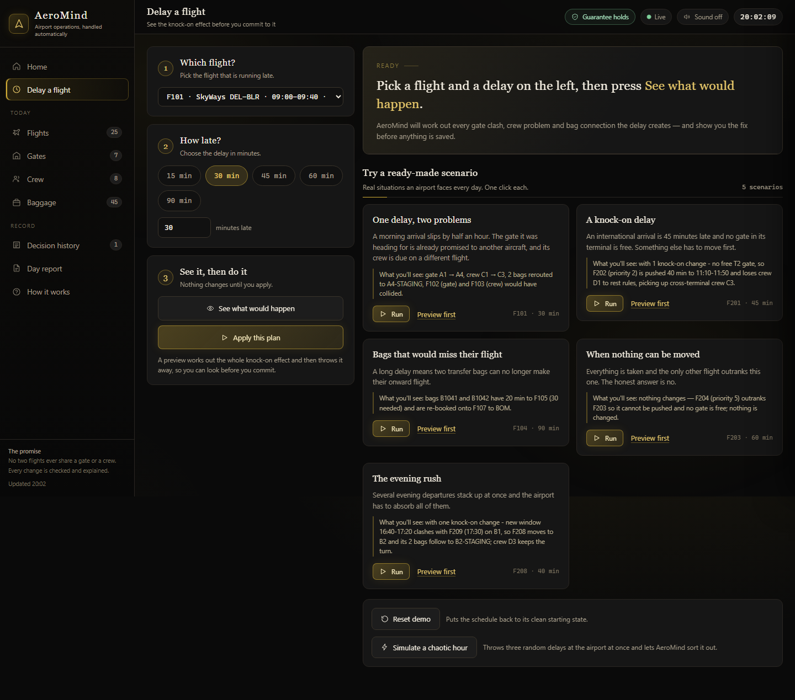

This is the control panel for causing (and fixing) a disruption by hand, titled "Delay a flight — See the knock-on effect before you commit to it." Three numbered steps run down the left: **1. Which flight?** (a dropdown of today's flights), **2. How late?** (quick buttons for 15/30/45/60/90 minutes, or a custom number), and **3. See it, then do it**, with two buttons — **See what would happen** and **Apply this plan** — captioned "Nothing changes until you apply." On the right is "Try a ready-made scenario": five one-click cards (covered in the demo script below), plus **Reset demo** and **Simulate a chaotic hour** buttons at the bottom. Nothing happens to the schedule just by picking a flight or a number — only pressing a button starts anything.

## 7. See what would happen

Clicking **See what would happen** produces a card tagged "PREVIEW · RESOLVED IN 17.9 MS": "F101 is 30 minutes late. AeroMind moved it to gate A4 and gave it crew C3. 2 bags sent to the new belt. No other flight is affected." Below the headline is a detail table — New time (09:00–09:40 struck through, replaced by 09:30–10:10), Gate (A1 → A4), Crew (C1 → C3), Baggage ("2 bags re-routed"), Other flights moved ("none"), and Trouble avoided ("F102, F103 would have clashed if nothing was done") — a **Share this plan** button that copies a plain-English summary, and a "Checked — this plan keeps the guarantee" line at the bottom. Nothing here has been written to the schedule yet. This is the direct answer to "surface the knock-on impact of a delay before it compounds" — the millisecond timestamp is the answer to "how fast," the rest of the card is the answer to "what, exactly."

## 8. Apply this plan

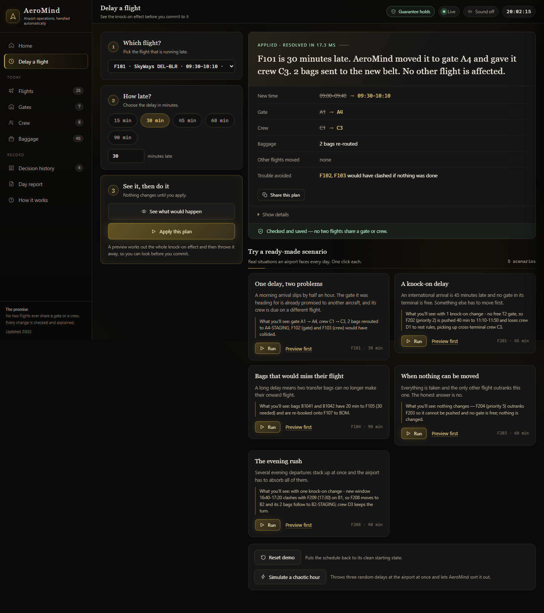

Clicking **Apply this plan** on the same card turns the preview into reality: the tag changes to "APPLIED · RESOLVED IN 17.3 MS," the flight dropdown on the left now shows F101's new time, and the footer changes to "Checked and saved — no two flights share a gate or crew." Everything else on the card reads identically to the preview, because AeroMind runs the same plan either way; the only difference is whether it's thrown away or saved. This is the moment the plan stops being a suggestion and becomes the airport's actual state.

## 9. Home, after a knock-on change

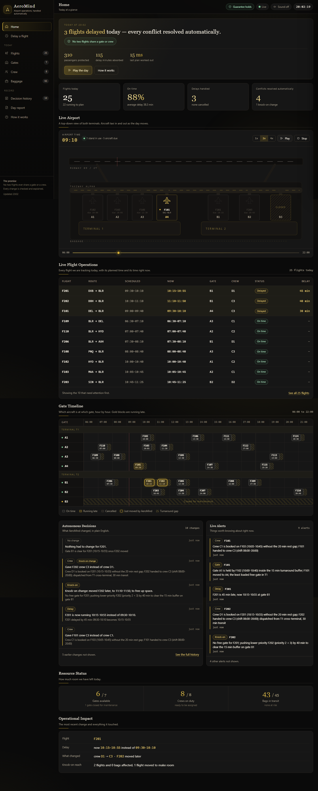

Back on Home after applying F201's 45-minute delay (the "knock-on delay" scenario), the hero numbers have moved — 310 passengers protected, 115 delay minutes absorbed, "15 ms" for the last plan — the banner reads "3 flights delayed today — every conflict resolved automatically," on time has dropped to 88%, and "Conflicts resolved automatically" shows 4 with "1 knock-on change" noted underneath. F201 and F202 sit at the top of Live Flight Operations in gold, the Live Airport map shows gate B1 outlined gold, and the Gate Timeline highlights their blocks the same way. The "Autonomous Decisions" panel spells out what happened — "Gave F202 crew C3 instead of crew D1," "Knock-on change: moved F202 later, to 11:10–11:50, to free up space" — each with a reason underneath, "Live Alerts" lists the same events by resource, and the ticker at the bottom keeps narrating it live. The "Guarantee holds" badge is the detail worth lingering on here: it should still say the guarantee holds immediately after a multi-resource change.

## 10. Flights, and one flight's story

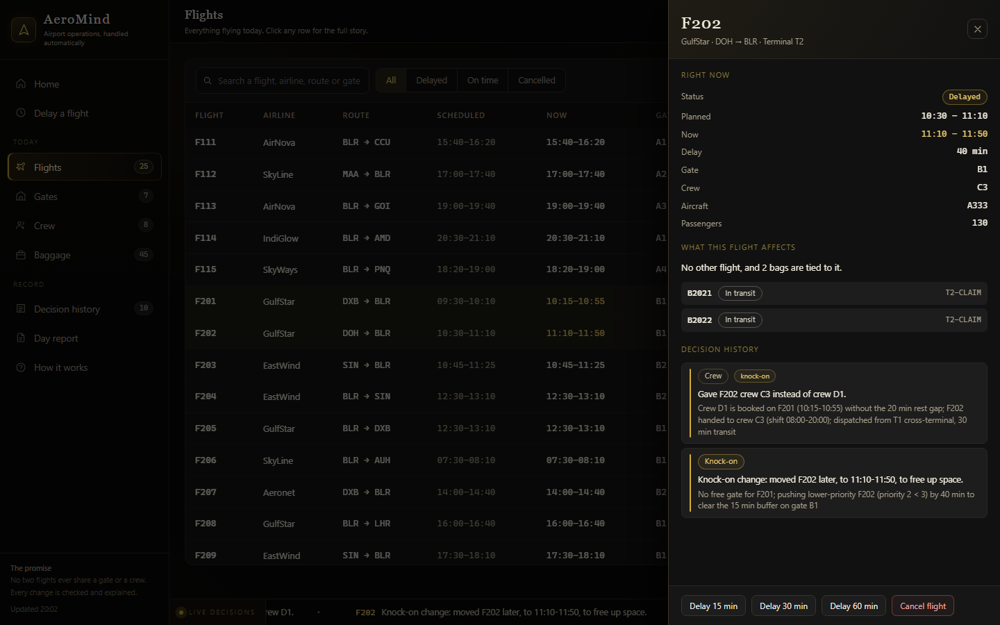

The Flights screen ("Everything flying today. Click any row for the full story.") is a searchable table of all 25 flights with tabs for All / Delayed / On time / Cancelled. Clicking a row — here, F202 — opens a side drawer: "RIGHT NOW" (status, planned vs. current time, delay, gate, crew, aircraft, passengers), "WHAT THIS FLIGHT AFFECTS" (its tied bags), and "DECISION HISTORY" for that one flight, each entry tagged (for example "Crew" + "knock-on"). At the bottom are quick actions: **Delay 15 min**, **Delay 30 min**, **Delay 60 min**, and **Cancel flight**. This is the "zoom in on one flight" view — useful for answering "why did *this* flight end up here" without digging through the whole decision history.

## 11. Gates

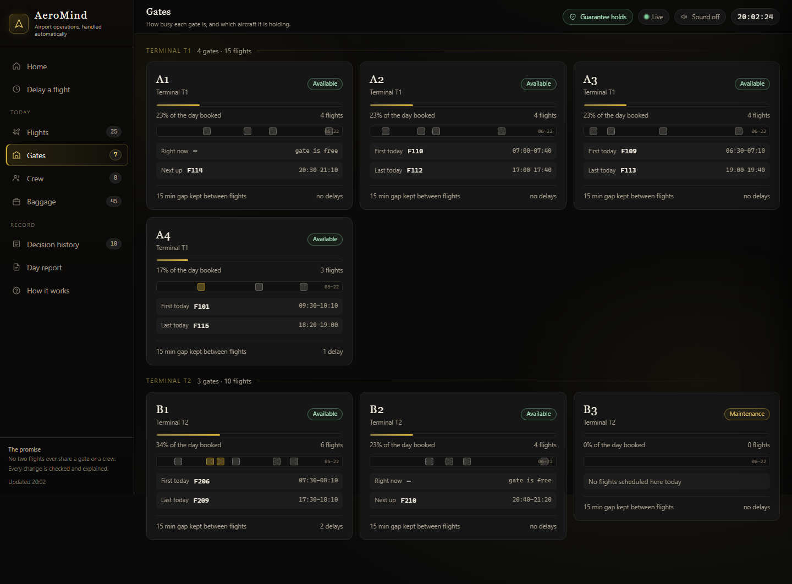

"Gates — How busy each gate is, and which aircraft it is holding," grouped by terminal (Terminal T1: 4 gates · 15 flights; Terminal T2: 3 gates · 10 flights). Each card shows a status pill (Available / Maintenance), how much of the day is booked, how many flights it has, what's on it right now (or "gate is free"), what's next, and a footer note — "15 min gap kept between flights" — with a delay count. Gate B3 always shows as Maintenance with 0 flights; that's a fixed constraint in the seed data, not a bug, and it's what makes Terminal T2 genuinely short on options during the "knock-on delay" and "when nothing can be moved" scenarios.

## 12. Crew

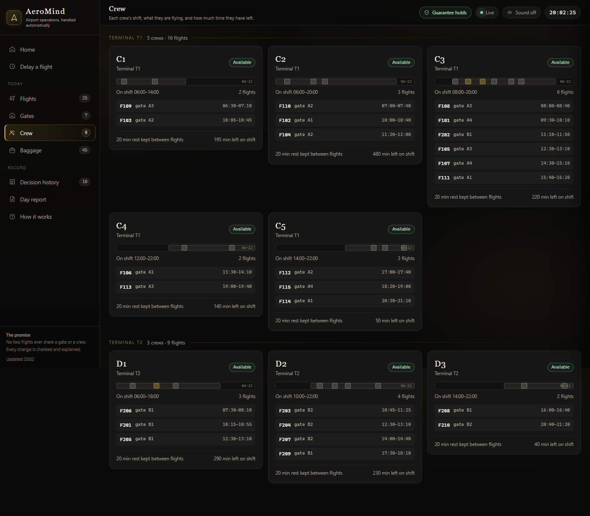

"Crew — Each crew's shift, what they are flying, and how much time they have left," grouped the same way (Terminal T1: 5 crews · 16 flights; Terminal T2: 3 crews · 9 flights). Each card shows the crew's shift as a bar across the day, its assigned flights with gate and time, and a footer — "20 min rest kept between flights" and how many minutes are left on shift. This is where the crew side of the guarantee becomes visible: no crew's card should ever show two overlapping flights, and a flight scheduled outside a crew's shift bar would be exactly the kind of problem the guarantee check exists to catch.

## 13. Baggage

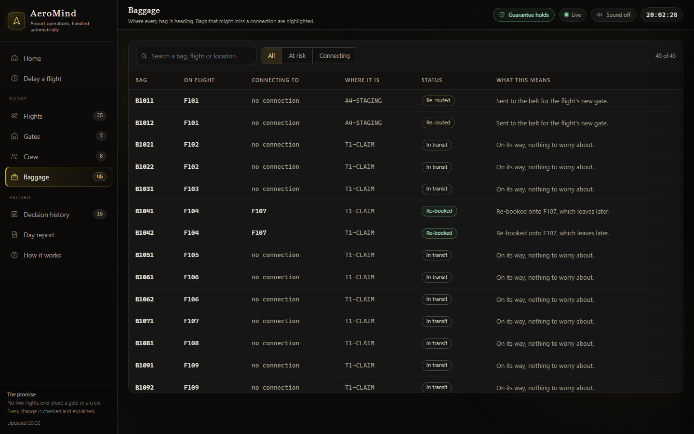

"Baggage — Where every bag is heading. Bags that might miss a connection are highlighted," a table of all 45 bags with tabs for All / At risk / Connecting. Columns run Bag, On flight, Connecting to, Where it is, Status, and — distinctively — "What this means," a plain-English sentence for every row ("On its way, nothing to worry about," "Re-booked onto F107, which leaves later"). This is the clearest place to watch the "bags that would miss their flight" scenario land: B1041 and B1042 change from "In transit" to "Re-booked," with F107 named as their new connecting flight.

## 14. Decision history

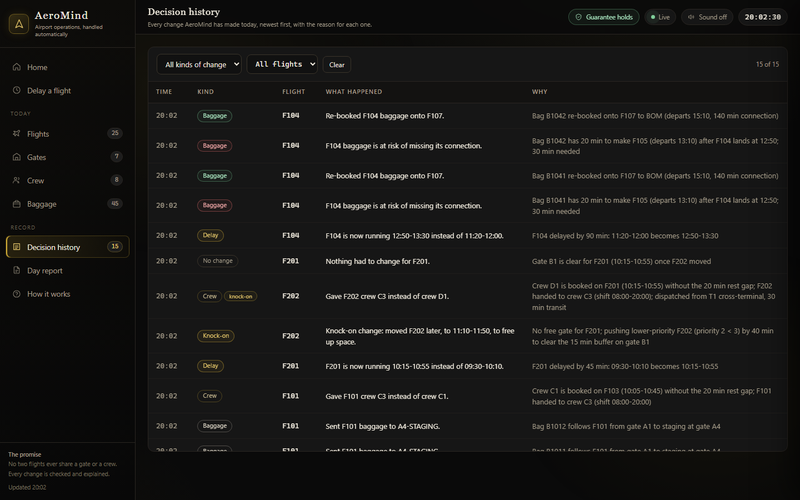

"Decision history — Every change AeroMind has made today, newest first, with the reason for each one," filterable by kind of change and by flight, with a **Clear** button to reset the filters. Columns run Time, Kind (Baggage, Delay, Crew, Knock-on, No change...), Flight, "What happened" (in plain English), and "Why" (the operational reason, down to the exact minute of the conflict — for example, "Bag B1042 has 20 min to make F105 (departs 13:10) after F104 lands at 12:50; 30 min needed"). This is the "propagate the effects of one change through all dependent resources" requirement made auditable — nothing here is a summary, it's the actual sequence of decisions, in order.

## 15. Day report

"Day report — A printable record of everything that happened today," with a **Print / Save as PDF** button at the top. The report itself reads like a real operations document: a masthead ("AeroMind — Daily Operations Report"), a meta line (terminals, gates, crews, date, when it was produced, how many disruptions), "The day in numbers," a numbered "Disruptions handled" list — each one naming the flight, how late it was, its status, and how many milliseconds it took to resolve, with the plain-English actions underneath — a full flight record table, a baggage exceptions table, and a closing "Guarantee" statement confirming no two flights ever shared a gate or a crew. This is the leave-behind: everything the live dashboard showed, as a document someone can print and file.

## 16. How it works

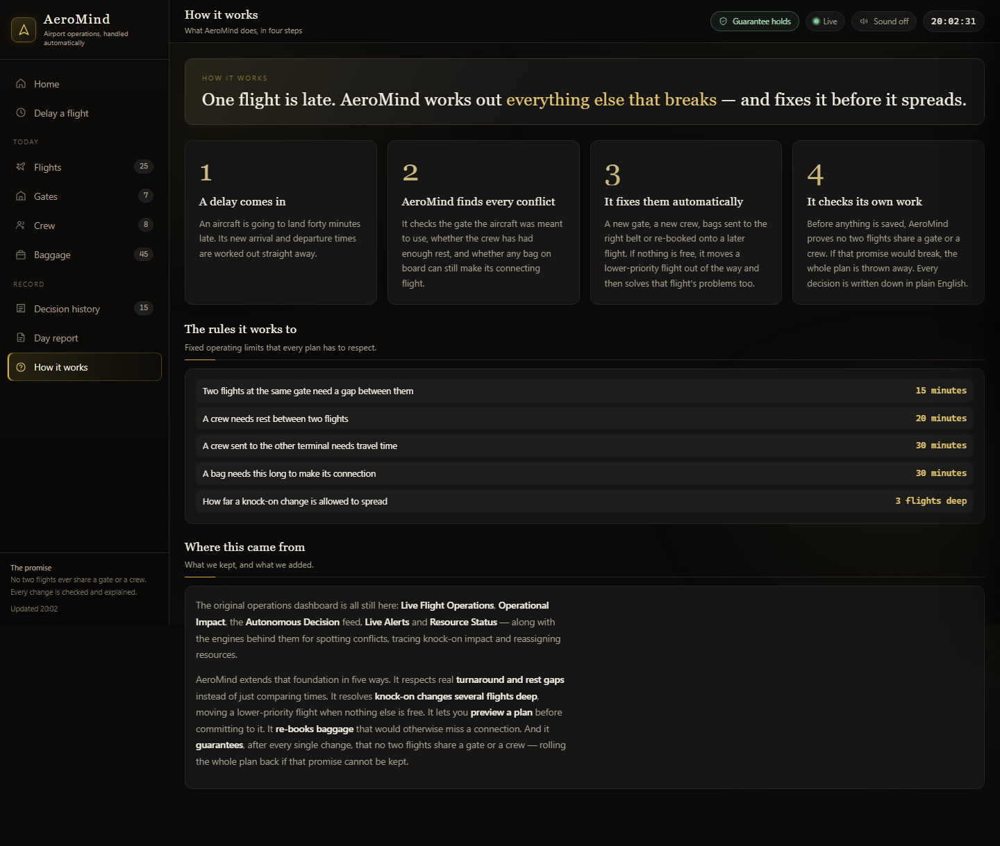

A plain-language explainer screen: "One flight is late. AeroMind works out everything else that breaks — and fixes it before it spreads," in four numbered steps — "A delay comes in," "AeroMind finds every conflict," "It fixes them automatically," "It checks its own work." Below that, "The rules it works to" lists the fixed operating limits every plan respects (gate gap 15 minutes, crew rest 20 minutes, crew travel time between terminals 30 minutes, bag connection 30 minutes, how far a knock-on change is allowed to spread — 3 flights deep). A final "Where this came from" section states plainly what was kept from the original dashboard and what AeroMind added on top.

## 17. A blocked plan

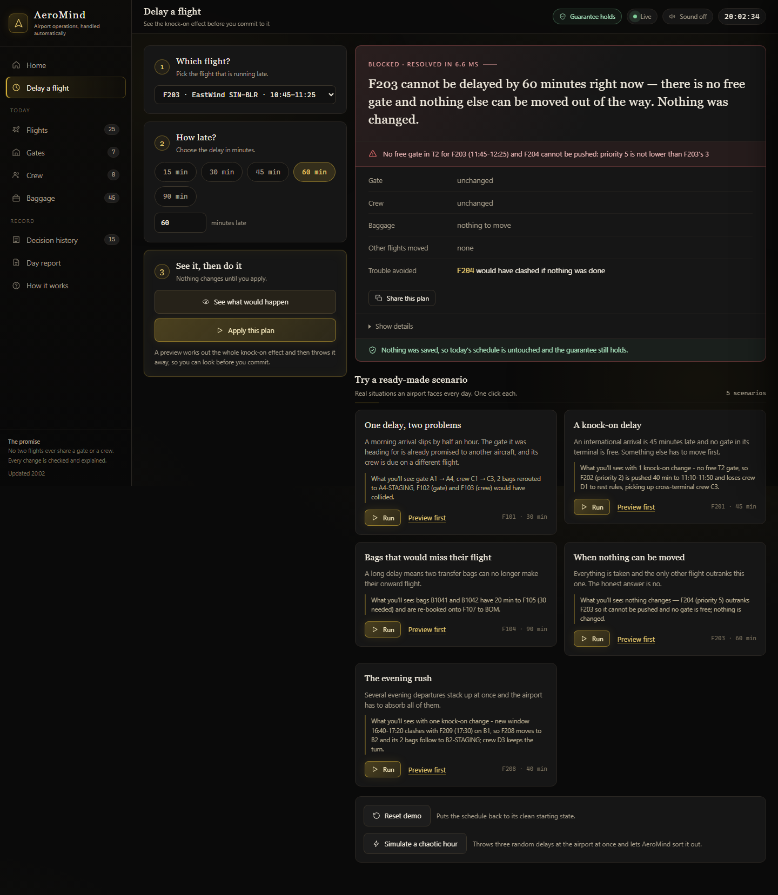

Not every delay has a clean fix, and this screen shows AeroMind admitting that instead of guessing. Delaying F203 by 60 minutes produces a card tagged "BLOCKED · RESOLVED IN 6.6 MS": "F203 cannot be delayed by 60 minutes right now — there is no free gate and nothing else can be moved out of the way. Nothing was changed," with the exact reason underneath. Gate and crew both read "unchanged," and the footer confirms "Nothing was saved, so today's schedule is untouched and the guarantee still holds." This screen matters as much as the successful ones — it's proof the system has a real stopping condition, and that even a refusal is worked out (and reported) in single-digit milliseconds, not left hanging.

## 18. Home, on a phone

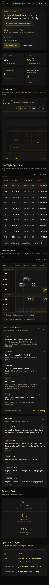

The same Home screen at phone width: the sidebar collapses into a slim top bar, and everything below — the headline, the hero numbers (180 passengers protected, 30 delay minutes absorbed, "17.7 ms" for the last plan in this shot), the KPI tiles, the Live Airport map, Live Flight Operations, the Gate Timeline, Autonomous Decisions, Live Alerts, Resource Status — reflows into a single readable column with no sideways scrolling. It shows the control room holds up outside a monitor, for an operator checking status from a handheld device.

---

## A 3-minute demo, click by click

**Recommended opener — let it run itself:**

1. Load the app, let the intro splash play (or click through it), then land on Home.
2. Click **Play the day** and say nothing for about 60 seconds. The virtual clock runs the operating day, pausing at five real disruptions to narrate each one and resolve it live on the Live Airport map — a gate clash, a knock-on push across two flights, a blocked delay, a missed connection re-booked, and an evening squeeze — then ends on the day summary: "Guarantee held all day."
3. From the day summary, click **Open the report** to show the printable Day report — the leave-behind document version of everything that just happened.

**If there's time for a hands-on follow-up:**

4. Click **Reset demo**. Pick any flight on Delay a flight, click **See what would happen**, point at the "RESOLVED IN N MS" tag and the "Trouble avoided" line, then click **Apply this plan** and show it land on Home.
5. Run "When nothing can be moved" by hand and point at the red "Blocked" card — the system refusing to guess rather than quietly breaking something.
6. Click **Simulate a chaotic hour**. While it settles, watch the "Guarantee holds" badge; confirm it still holds once it's done.

A full recorded run of step 2 (one Play-the-day pass at 2x speed, 59 seconds) is at `docs/demo-play-the-day.webm` if you want to preview the pacing beforehand.

**A few extra controls worth knowing about:** press **Ctrl+K** (Cmd+K on a Mac) anywhere to open a command palette — typing things like "delay F101 30," "play the day," or "reset" and pressing Enter does exactly that without touching the mouse. Press **?** to see the full list of keyboard shortcuts. Sound is off by default; there's a toggle for it in the top bar. Any plan card — preview, applied, or blocked — has a **Share this plan** button that copies a plain-English summary you can paste into chat or a ticket.

## Glossary

**Gate turnaround buffer** — the minimum gap AeroMind requires between one flight leaving a gate and the next flight arriving at it (15 minutes in this build), so ground crews have time to clean, refuel, and reposition the aircraft. If two flights' windows would overlap once this buffer is added, that's a gate conflict.

**Crew rest** — the minimum gap AeroMind requires between one assignment ending for a crew and their next one starting (20 minutes here). A crew can also only be given flights that fall inside their scheduled shift.

**Knock-on change** — a change that happens not because a flight itself was delayed, but because another flight's delay forced it to move (a different gate, a different crew, a re-booked connection). AeroMind's screens tag these moves "Knock-on" and limit how far they're allowed to spread (3 flights deep).

**Blocked** — the outcome when AeroMind cannot find any way to resolve a conflict — no free gate or crew, and the flight in the way can't be moved because it's equal or higher priority. Nothing is changed; the plan is reported as blocked, with the reason spelled out.

**Guarantee** — AeroMind's core promise, shown as the "Guarantee holds" badge on every screen: no two flights are ever assigned the same gate or the same crew at overlapping times. Checked automatically after every change; if a change would ever break it, that change is thrown away instead of kept.

**Preview** — clicking "See what would happen" runs the full plan without saving it, so you can see exactly what would change before deciding whether to apply it.

**Resolved in N ms** — the small timestamp on every plan card (preview, applied, or blocked) showing how long AeroMind took to work out that plan, down to a tenth of a millisecond — proof the whole conflict search, not just the easy path, happens fast enough to feel instant.
